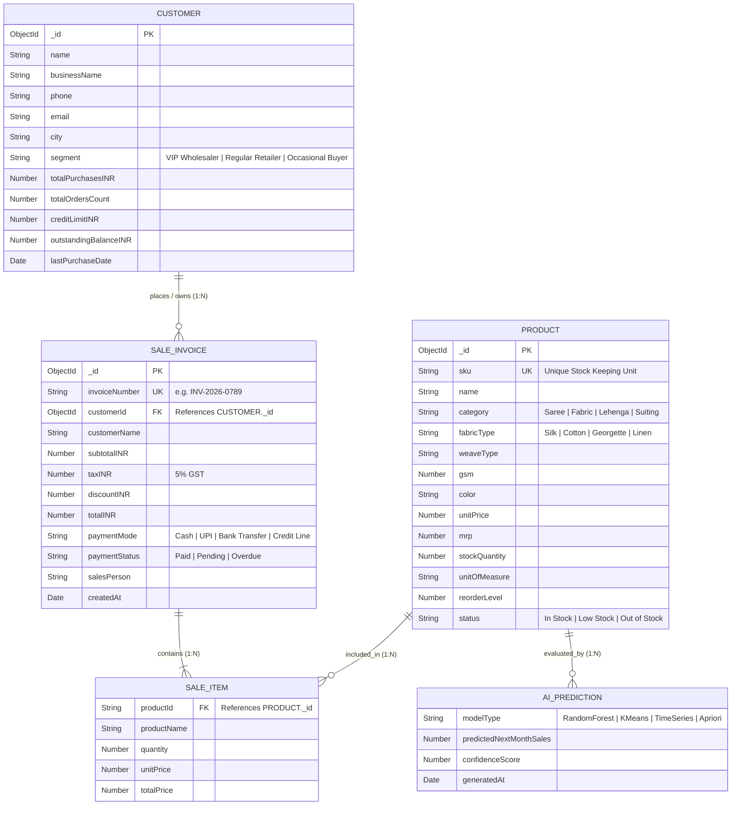

# AI-Powered Textile Sales & Inventory Prediction System

## A Decision Support System for Textile Wholesale and Retail Businesses

---

**A Major Project Synopsis**  
**Submitted in partial fulfillment of the requirements for the degree of**  
**Bachelor of Technology in Computer Science and Engineering**

---

| | |
|---|---|
| **Student Name** | Khushi Soni |
| **Roll Number** | 2334181 |
| **Department** | Computer Science and Engineering |
| **College** | AGC Amritsar |
| **Semester** | 7th Semester (B.Tech, 4th Year) |
| **Project Guide** | [Guide Name], [Designation] |
| **Academic Year** | 2026–2027 |

---
---

## 1. Introduction

### 1.1 Overview

The Indian textile industry contributes approximately 2.3% to the country's GDP and employs over 45 million workers, making it the second-largest employer after agriculture (Ministry of Textiles, Government of India, 2024). Despite its massive scale, a significant majority of small and medium textile wholesale and retail businesses — particularly in major textile hubs such as Surat (Gujarat), Jaipur (Rajasthan), Kanchipuram (Tamil Nadu), and Amritsar (Punjab) — continue to rely on manual ledger-based bookkeeping systems, simple billing software, or spreadsheet-based inventory tracking.

These traditional tools are adequate for recording historical sales transactions but fundamentally lack the capability to answer **forward-looking business questions** such as:

- *Which fabric categories will experience demand surges in the upcoming festive or wedding season?*
- *Which textile SKUs are approaching stockout levels and require immediate restocking?*
- *Which customer accounts represent the highest lifetime value, and which are at risk of attrition?*
- *Which product combinations are frequently purchased together, enabling strategic bundle offers?*

This project addresses these gaps by designing and implementing a **Decision Support System (DSS)** — a computer-based information system that supports business decision-making activities through data analysis and Machine Learning predictions. The proposed system, named **Ks Arts AI**, combines a modern web-based dashboard interface with a Machine Learning inference microservice to deliver actionable intelligence for textile business operations.

### 1.2 Motivation

The motivation for this project stems from three key observations:

1. **Data-rich but insight-poor businesses:** Textile wholesalers accumulate vast transactional data across products, customers, and invoices, but lack tools to extract actionable patterns from this data.
2. **Seasonal demand volatility:** Textile demand is highly seasonal (wedding seasons, Diwali, Eid, summer collections). Manual inventory planning leads to either dead stock (overstocking) or lost sales (stockouts).
3. **Academic relevance:** This project provides an opportunity to apply Data Science and Machine Learning algorithms — Random Forest Regression, K-Means Clustering, TimeSeries Analysis, and Apriori Association Mining — to a real-world business domain, bridging the gap between theoretical knowledge and practical application.

### 1.3 Existing Solutions and Differentiation

| Existing Solution | Limitations | How Ks Arts AI Differs |
|---|---|---|
| **Tally ERP / Vyapar** | Focuses on accounting and billing. No demand forecasting or customer segmentation capabilities. | Integrates ML-based demand forecasting and customer RFM segmentation alongside standard inventory management. |
| **Zoho Inventory** | Cloud-based inventory management for general retail. No textile-specific domain intelligence. | Provides textile-specific features (GSM, weave type, fabric category) with domain-aware ML predictions. |
| **Custom Excel/Power BI dashboards** | Static analysis requiring manual data entry. No real-time predictions or automated restock alerts. | Delivers real-time, automated predictions via a decoupled ML microservice with a self-updating web dashboard. |

---

## 2. Problem Statement

Small and medium textile wholesale and retail businesses in India face critical challenges in **demand forecasting, inventory optimization, customer retention, and product bundling strategy**. Traditional billing software and manual ledger systems are limited to recording past transactions and cannot provide predictive or prescriptive analytics.

Specifically, the following problems are addressed:

1. **Unpredictable demand fluctuations:** Textile demand is highly seasonal (festive seasons, wedding months). Without forecasting tools, business owners either overstock (leading to dead inventory and capital lock-up) or understock (leading to lost sales and dissatisfied customers).

2. **Absence of customer intelligence:** Business owners treat all buyers uniformly, lacking the ability to identify and prioritize high-value wholesale accounts versus at-risk clients who may be shifting to competitors.

3. **No data-driven product recommendations:** Textile retailers miss cross-selling opportunities because they cannot identify which products are frequently purchased together.

4. **Fragmented decision-making:** Sales data, inventory levels, and customer information exist in silos (separate Excel files, paper ledgers, or basic software), preventing holistic business intelligence.

**Why is this problem important?**  
The textile retail sector in India is valued at over ₹10 lakh crore (IBEF, 2024). Even marginal improvements in demand prediction accuracy (reducing dead stock by 10-15%) and customer retention (identifying at-risk accounts early) can translate to significant financial savings for individual businesses.

---

## 3. Objectives

### 3.1 Primary Objectives

1. **Design and develop a web-based Decision Support System (DSS)** that enables textile business owners to manage products, customers, sales invoices, and inventory through an intuitive dashboard interface.

2. **Implement a Sales Revenue Prediction module** using Random Forest Regression to forecast next-month revenue based on historical sales patterns and seasonal trends.

3. **Implement a Fabric Demand Forecasting module** using TimeSeries Analysis to predict 30-day product-level demand and generate automated low-stock reorder alerts.

4. **Implement a Customer Segmentation module** using K-Means Clustering on RFM (Recency, Frequency, Monetary) features to classify buyers into VIP Wholesalers, Regular Retailers, and At-Risk Client segments.

5. **Implement a Product Bundle Recommendation module** using Apriori Association Rule Mining to discover "Frequently Bought Together" fabric combinations for cross-selling strategies.

### 3.2 Secondary Objectives

6. Deploy the web application on a cloud hosting platform (Vercel) with a cloud database (MongoDB Atlas) for universal accessibility.

7. Build a resilient architecture where the DSS dashboard functions independently even when the ML microservice is offline, using intelligent mock fallback predictions.

8. Create a modular, maintainable codebase following the Separation of Concerns principle with a decoupled frontend-backend-ML architecture.

---

## 4. Proposed System / Methodology

### 4.1 System Architecture

The proposed system follows a **Decoupled Three-Tier Architecture** comprising:

```
┌─────────────────────────────────────────────────────────────┐
│                    PRESENTATION LAYER                        │
│            (Next.js 16 + React 19 + Tailwind CSS)           │
│                                                             │
│  Dashboard │ Products │ Customers │ Sales │ AI Hub │ Reports│
└──────────────────────────┬──────────────────────────────────┘
                           │ Server Actions (TypeScript)
                           ▼
┌──────────────────────────────────────────────────────────────┐
│                      DATA LAYER                              │
│              (MongoDB Atlas + Mongoose ORM)                   │
│                                                              │
│   Products Collection │ Customers Collection │ Sales Collection│
└──────────────────────────────────────────────────────────────┘
                           │
                           ▼
┌──────────────────────────────────────────────────────────────┐
│                   INTELLIGENCE LAYER                         │
│           (Python 3 + Flask + Scikit-Learn)                  │
│                                                              │
│  RandomForest │ K-Means │ TimeSeries │ Apriori              │
│  (Sales Pred) │(Cust Seg)│(Demand)   │(Bundles)             │
└──────────────────────────────────────────────────────────────┘
```

**Layer 1 — Presentation Layer (Next.js 16):** Renders the DSS dashboard, handles user interactions (role switching, form submissions, navigation), and displays charts and KPI visualizations using the Recharts library.

**Layer 2 — Data Layer (MongoDB Atlas):** Stores all persistent business data — product catalog (SKU, fabric type, pricing, stock levels), customer profiles (RFM metrics, credit limits, segmentation), and sales invoices (line items, GST calculations, payment status). Connected via Mongoose ORM through Next.js Server Actions.

**Layer 3 — Intelligence Layer (Flask + Scikit-Learn):** A lightweight Python microservice that loads pre-trained ML model artifacts (`.joblib` files) and exposes REST API endpoints for real-time inference. The frontend communicates with this layer through a server-side HTTP bridge (`ai-service.ts`) that gracefully falls back to mock predictions if the Flask service is offline.

### 4.2 Methodology

The project follows a **UI-First Development Methodology**:

1. **Phase 1 — Design System & UI Shell:** Establish visual design tokens (Light Theme color palette, typography, spacing system) and build the complete dashboard interface with 8 pages using realistic Indian textile domain mock data.

2. **Phase 2 — Database Integration:** Connect the UI to MongoDB Atlas cloud database via Mongoose ORM. Implement Server Actions for Create, Read, Update, Delete (CRUD) operations. Build a 1-Click Database Seeder for instant data initialization.

3. **Phase 3 — Interactive CRUD Modals:** Add form-based dialogs for creating new products, customers, and sales invoices with Zod schema validation.

4. **Phase 4 — ML Microservice Development:** Train Scikit-Learn models on textile sales datasets. Build the Flask REST API to serve predictions. Connect the frontend to Flask via a resilient HTTP bridge.

5. **Phase 5 — Testing, Verification & Documentation:** Execute strict TypeScript type-checking (`npx tsc --noEmit`), production build verification (`npm run build`), and generate comprehensive project documentation.

### 4.3 ML Algorithms Used

| Algorithm | Module | Input Features | Output | Evaluation Metric |
|---|---|---|---|---|
| **Random Forest Regressor** (Ensemble Learning) | Sales Prediction | Month, year, previous revenue, order count | Predicted next-month revenue (₹) | RMSE, R² Score |
| **K-Means Clustering** (Unsupervised Learning) | Customer Segmentation | Recency (days), Frequency (orders), Monetary (₹) | 3 segments: VIP, Regular, At-Risk | Silhouette Coefficient, Elbow Method |
| **TimeSeries Trend Analysis** | Demand Forecasting | Historical daily sales per SKU, current stock | 30-day demand forecast, stockout risk % | MAE, Forecast Accuracy % |
| **Apriori Association Mining** | Bundle Recommendations | Historical invoice line items | Association rules (Support, Confidence, Lift) | Support ≥ 0.1, Confidence ≥ 0.5 |

---

## 5. System Design

### 5.1 Database Schema (MongoDB Collections)

#### Products Collection
```
{
  _id:            ObjectId (auto-generated primary key)
  sku:            String    (unique, e.g., "TXT-001")
  name:           String    (e.g., "Pure Banarasi Zari Brocade Saree")
  category:       String    (e.g., "Saree", "Fabric", "Lehenga", "Suiting")
  fabricType:     String    (e.g., "Silk", "Cotton", "Georgette", "Linen")
  weaveType:      String    (e.g., "Jacquard", "Plain", "Twill")
  gsm:            Number    (grams per square meter)
  color:          String    (e.g., "Royal Maroon", "Ivory Gold")
  unitPrice:      Number    (wholesale price in INR)
  mrp:            Number    (retail MRP in INR)
  stockQuantity:  Number    (current inventory count)
  unitOfMeasure:  String    ("meters", "pieces", "sets")
  reorderLevel:   Number    (minimum stock threshold for alerts)
  supplierName:   String    (vendor/supplier name)
  status:         String    (enum: "In Stock", "Low Stock", "Out of Stock")
  createdAt:      Date      (auto-generated timestamp)
  updatedAt:      Date      (auto-generated timestamp)
}
```

#### Customers Collection
```
{
  _id:                   ObjectId
  name:                  String    (e.g., "Rajesh Sharma")
  businessName:          String    (e.g., "Saree Niketan Wholesale")
  phone:                 String    (e.g., "+91 98765 43210")
  email:                 String
  city:                  String    (e.g., "Surat", "Jaipur", "Delhi")
  segment:               String    (enum: "VIP Wholesaler", "Regular Retailer", "Occasional Buyer")
  totalPurchasesINR:     Number    (lifetime spending)
  totalOrdersCount:      Number    (total orders placed)
  creditLimitINR:        Number    (approved credit limit)
  outstandingBalanceINR: Number    (pending payment amount)
  lastPurchaseDate:      Date
  createdAt:             Date
  updatedAt:             Date
}
```

#### Sales Collection
```
{
  _id:              ObjectId
  invoiceNumber:    String    (e.g., "INV-2026-0789")
  customerId:       ObjectId  (reference to Customers collection)
  customerName:     String
  items:            Array [   (line items)
    {
      productId:    String
      productName:  String
      quantity:     Number
      unitPrice:    Number
      totalPrice:   Number
    }
  ]
  subtotalINR:      Number
  taxINR:           Number    (5% GST on textiles)
  discountINR:      Number
  totalINR:         Number
  paymentMode:      String    (enum: "Cash", "UPI", "Bank Transfer", "Credit Line")
  paymentStatus:    String    (enum: "Paid", "Pending", "Overdue")
  salesPerson:      String    (e.g., "Khushi Soni (Owner)")
  createdAt:        Date
}
```

### 5.2 Entity-Relationship (ER) Diagram

The ER Diagram illustrates the logical data model of the **Ks Arts AI Decision Support System**, defining key entities, their attributes, primary keys (PK), foreign keys (FK), and Cardinality relationships.



#### Cardinality & Relationship Breakdown:
1. **CUSTOMER to SALE_INVOICE (`1 : N`)**: A single Customer account can place zero, one, or multiple Sales Invoices (`1 : N`). Each Sales Invoice is associated with exactly one Customer (`customerId` FK).
2. **SALE_INVOICE to SALE_ITEM (`1 : N`)**: Each Sales Invoice contains one or more Line Items (`1 : N`). Each Line Item belongs to exactly one invoice context.
3. **PRODUCT to SALE_ITEM (`1 : N`)**: A Product SKU can be purchased across multiple Sale Invoice Line Items (`1 : N`).
4. **PRODUCT to AI_PREDICTION (`1 : N`)**: Product stock levels and sales histories feed into AI Demand Forecasting and Apriori Association Rule evaluations (`1 : N`).

### 5.3 Data Flow Diagram (Level 0)

```
                        ┌─────────────┐
                        │  Business   │
                        │   Owner     │
                        │  (Khushi)   │
                        └──────┬──────┘
                               │
                    Views Dashboard / Enters Data
                               │
                               ▼
┌──────────────────────────────────────────────────────────────┐
│                    Ks Arts AI DSS                             │
│                                                              │
│  ┌────────────┐   ┌──────────────┐   ┌───────────────────┐  │
│  │ Product    │   │ Sales &      │   │ AI Predictions    │  │
│  │ Management │   │ Invoice      │   │ & Intelligence    │  │
│  │ Module     │   │ Module       │   │ Module            │  │
│  └─────┬──────┘   └──────┬───────┘   └────────┬──────────┘  │
│        │                 │                     │             │
│        ▼                 ▼                     ▼             │
│  ┌──────────────────────────────┐   ┌───────────────────┐   │
│  │     MongoDB Atlas            │   │  Flask ML Service  │   │
│  │  (Products, Customers, Sales)│   │  (Scikit-Learn)    │   │
│  └──────────────────────────────┘   └───────────────────┘   │
└──────────────────────────────────────────────────────────────┘
```

### 5.4 Use Case Diagram (Key Actors & Actions)

```
                          ┌─── View Executive Dashboard
                          ├─── Manage Product Catalog (Add/Edit/View)
     ┌──────────┐        ├─── Manage Customer Directory
     │  Admin   │────────├─── Create Sales Invoices
     │ (Owner)  │        ├─── View AI Predictions & Forecasts
     └──────────┘        ├─── Generate Reports
                          ├─── Seed Database (1-Click Init)
                          └─── Configure System Settings

                          ┌─── View Executive Dashboard
     ┌──────────┐        ├─── View Product Catalog
     │ Employee │────────├─── View Sales Invoices
     │ (Sales)  │        └─── View AI Predictions
     └──────────┘
```

---

## 6. Technologies Used

### 6.1 Frontend Technologies

| Technology | Version | Purpose |
|---|---|---|
| **Next.js** | 16 (App Router) | Full-stack React framework with server-side rendering and file-based routing |
| **React** | 19 | Component-based UI library for building interactive dashboard interfaces |
| **TypeScript** | 5.x (Strict Mode) | Statically-typed JavaScript for compile-time error detection |
| **Tailwind CSS** | v4 | Utility-first CSS framework for responsive Light Theme styling |
| **Recharts** | 2.x | React charting library for sales forecast area charts and KPI visualizations |
| **Lucide React** | Latest | Professionally designed SVG icon library |
| **React Hook Form + Zod** | Latest | Form state management with schema-based validation |

### 6.2 Backend & Database Technologies

| Technology | Version | Purpose |
|---|---|---|
| **Node.js** | 20+ LTS | JavaScript runtime for Next.js server execution |
| **MongoDB Atlas** | Cloud (M0 Free Tier) | NoSQL document database for flexible textile product schemas |
| **Mongoose** | 8.x | Object Document Mapper (ODM) for MongoDB schema validation and querying |
| **Next.js Server Actions** | Built-in | Type-safe server functions for secure database CRUD operations |

### 6.3 Machine Learning Technologies

| Technology | Version | Purpose |
|---|---|---|
| **Python** | 3.10+ | Core language for ML model training and inference |
| **Flask** | 3.x | Lightweight Python web framework for REST API serving |
| **Flask-CORS** | Latest | Cross-Origin Resource Sharing middleware |
| **Scikit-Learn** | 1.x | Machine Learning library (RandomForest, KMeans) |
| **Pandas** | 2.x | Data manipulation and analysis |
| **NumPy** | 1.x | Numerical computing and array operations |
| **Joblib** | Latest | ML model serialization and deserialization |

### 6.4 Deployment & DevOps

| Technology | Purpose |
|---|---|
| **Vercel** | Cloud hosting for Next.js frontend (automatic CI/CD from GitHub) |
| **Render / PythonAnywhere** | Cloud hosting for Flask ML microservice |
| **Git & GitHub** | Version control and source code repository |

---

## 7. Hardware & Software Requirements

### 7.1 Hardware Requirements

| Component | Minimum Specification |
|---|---|
| **Processor** | Intel Core i3 (8th Gen) or equivalent |
| **RAM** | 4 GB (8 GB recommended) |
| **Storage** | 2 GB free disk space |
| **Internet** | Broadband connection (for MongoDB Atlas and Vercel) |
| **Display** | 1366 × 768 resolution or higher |

### 7.2 Software Requirements

| Software | Version | Purpose |
|---|---|---|
| **Operating System** | Windows 10/11, macOS, or Linux | Development and runtime |
| **Node.js** | v20+ LTS | Next.js runtime |
| **Python** | v3.10+ | Flask ML service runtime |
| **npm** | v10+ | JavaScript package manager |
| **pip** | v23+ | Python package manager |
| **VS Code** | Latest | Integrated Development Environment |
| **Git** | v2.40+ | Version control |
| **Web Browser** | Chrome / Edge / Firefox (latest) | Application access and testing |
| **MongoDB Atlas** | Cloud (M0 Free) | Cloud database (no local installation needed) |

---

## 8. Expected Outcome / Deliverables

### 8.1 Expected Working Outcome

Upon completion, the system will deliver a **fully functional, cloud-deployed Decision Support System** accessible via a public URL (`ksarts.vercel.app`), consisting of:

1. **Executive Business Dashboard** — Real-time KPI cards displaying monthly revenue, order count, catalog size, and stock alerts, accompanied by an interactive Recharts area chart comparing actual revenue versus AI-predicted revenue.

2. **Product Catalog Manager** — Complete textile product inventory with fabric specifications (GSM, weave type, fabric category), wholesale and retail pricing, stock levels, and automated low-stock status badges.

3. **Customer Intelligence Directory** — Customer profiles with RFM-based segmentation labels (VIP Wholesaler, Regular Retailer, At-Risk Client), credit limits, outstanding balances, and purchase history.

4. **Sales Invoice System** — Invoice log with multi-item line items, automatic 5% GST textile tax calculation, payment status tracking (Paid/Pending/Overdue), and discount management.

5. **AI Predictions Hub** — Interactive visualization of all four ML modules: sales revenue forecast, 30-day fabric demand predictions with restock alerts, customer segmentation scatter plot, and "Frequently Bought Together" bundle recommendations.

### 8.2 Key Deliverables

| # | Deliverable | Format |
|---|---|---|
| 1 | Live deployed DSS web application | URL (Vercel) |
| 2 | Source code repository | GitHub |
| 3 | Trained ML model artifacts | `.joblib` files |
| 4 | Project Synopsis | Document (this file) |
| 5 | Final Project Report | Document |
| 6 | Student Viva Preparation Guide | Markdown |
| 7 | Project Demonstration | Live demo during viva |

---

## 9. Work Plan / Timeline

### 9.1 Phase-Wise Breakdown

| Phase | Duration | Activities | Status |
|---|---|---|---|
| **Phase 1:** Design System & UI Shell | Week 1–2 | Establish Light Theme design tokens, build responsive Sidebar + Header layout, create 8 dashboard pages with Indian textile mock data, implement KPI cards and Recharts visualizations | ✅ Complete |
| **Phase 2:** Database Integration | Week 3–4 | Set up MongoDB Atlas cloud database, define Mongoose schemas (Product, Customer, Sale), implement Server Actions for CRUD operations, build 1-Click Database Seeder | ✅ Complete |
| **Phase 3:** Interactive Modals & CRUD | Week 5–6 | Build Product Add/Edit form modal with Zod validation, connect pages to live MongoDB data with mock fallback, implement role-based access control (Admin vs Employee) | ✅ Complete |
| **Phase 4:** ML Microservice | Week 7–10 | Train RandomForest and KMeans models using Scikit-Learn, build Flask REST API endpoints, implement AI service bridge in Next.js with graceful fallback handling | ✅ Complete |
| **Phase 5:** Testing & Documentation | Week 11–12 | Execute TypeScript strict type-checking (0 errors), production build verification (0 errors), write project documentation, create Student Viva Guide | ✅ Complete |
| **Phase 6:** Enhancements | Week 13–16 | Customer and Sale creation modals, full Apriori and TimeSeries implementation in Flask, PDF report export, final viva preparation | 🔜 Planned |

### 9.2 Key Milestones

| Milestone | Target | Status |
|---|---|---|
| Complete UI with all 8 pages | Week 2 | ✅ Achieved |
| MongoDB Atlas connected & seeded | Week 4 | ✅ Achieved |
| First ML model serving predictions | Week 8 | ✅ Achieved |
| Production build with 0 errors | Week 11 | ✅ Achieved |
| Cloud deployment on Vercel | Week 12 | ✅ Achieved |
| Viva demonstration ready | Week 16 | 🔜 In Progress |

---

## 10. References

1. Breiman, L. (2001). *Random Forests*. Machine Learning, 45(1), 5–32. Springer. DOI: 10.1023/A:1010933404324

2. MacQueen, J. B. (1967). *Some Methods for Classification and Analysis of Multivariate Observations*. Proceedings of the 5th Berkeley Symposium on Mathematical Statistics and Probability, 1, 281–297.

3. Agrawal, R., Imielinski, T., & Swami, A. (1993). *Mining Association Rules Between Sets of Items in Large Databases*. Proceedings of ACM SIGMOD International Conference on Management of Data, 207–216.

4. Hughes, A. M. (1994). *Strategic Database Marketing*. Probus Publishing Company. (RFM Analysis framework)

5. Pedregosa, F., et al. (2011). *Scikit-learn: Machine Learning in Python*. Journal of Machine Learning Research, 12, 2825–2830.

6. Ministry of Textiles, Government of India. (2024). *Annual Report 2023-2024*. Available at: https://texmin.gov.in

7. India Brand Equity Foundation (IBEF). (2024). *Textile Industry in India*. Available at: https://www.ibef.org/industry/textiles

8. Next.js Documentation. (2026). *Next.js 16 App Router*. Vercel Inc. Available at: https://nextjs.org/docs

9. MongoDB Documentation. (2026). *MongoDB Atlas — Cloud Database Service*. MongoDB Inc. Available at: https://www.mongodb.com/docs/atlas

10. Flask Documentation. (2026). *Flask — Web Development, One Drop at a Time*. Pallets Projects. Available at: https://flask.palletsprojects.com

---

*This synopsis was prepared as part of the B.Tech (COE) 7th-Semester Major Project at AGC Amritsar.*
